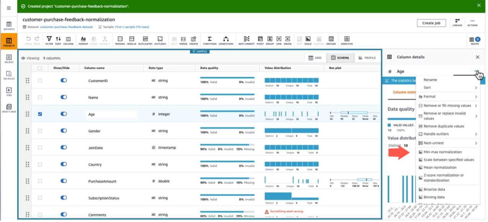
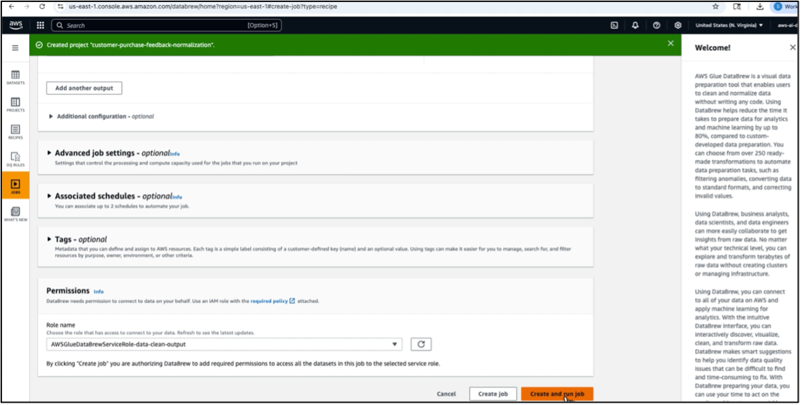

# **Hands-on Lab: Data Formatting and Normalization**

## **Objective**

This lab focuses on using **AWS Glue DataBrew** to:

* Reformat inconsistent data
* Normalize numeric fields
* Apply min-max scaling for ML model readiness
* Create a DataBrew recipe and write normalized outputs to Amazon S3

By the end, you will have an automated transformation workflow suitable for downstream machine learning pipelines.

---

🎥 **YouTube Tutorial:**  
https://youtu.be/0Q07_GV1MeM

---

> ⚠️ **AWS Cost Warning**
>
> This lab uses **AWS Glue DataBrew projects**, **recipe jobs**, **profile jobs**, and Amazon **S3**, which can incur AWS charges.
>
> To minimize costs:
>
> * Delete DataBrew **projects**, **datasets**, **recipes**, and **jobs** when finished
> * Remove S3 output folders created by transformation jobs
> * Avoid re-running profile jobs unless necessary
> * Use AWS Budgets with alerts ($1–$5 recommended)
>
> Always clean up DataBrew jobs and S3 files after completing the exercise.

---

# **Dataset Used in This Lab**

### **customer_feedback_dataset.csv**

```csv
CustomerID,Name,Age,Gender,JoinDate,Country,PurchaseAmount,SubscriptionStatus,Comments
C001,John Doe,34,Male,2021-06-15,USA,152.45,Active,"Quick response. Good service!"
C002,Jane Smith,28,Female,2020-12-10,UK,98.00,Active,"Late delivery"
C003,Raj Patel,45,Male,2019-11-05,India,0.00,Inactive,""
C004,Emily Zhang,22,Female,2022-01-22,China,187.90,Active,"Helpful support."
C005,Luis Gomez,38,Male,2018-03-30,Mexico,120.10,Active,"Pricey but worth it"
C006,Sara Kim,29,Female,2021-09-08,South Korea,99.99,Inactive,"No complaints"
C007,Ahmed Ali,31,Male,2019-05-17,UAE,150.00,Active,"Happy customer!"
C008,Ana Sousa,27,Female,,Brazil,,Active,"Missing value test"
C009,Mike O'Neil,40,Male,2020-07-04,Canada,132.00,Active,""
C010,Ling Wei,26,Female,2021-02-11,Singapore,145.50,Inactive,"Service needs improvement"
```

This dataset contains:

* Missing values (JoinDate, PurchaseAmount)
* Numeric fields (Age, PurchaseAmount) suitable for scaling
* Text fields requiring clean-up

---

# **Step 1: Upload the Dataset to Amazon S3**

1. Open the **Amazon S3** console
2. Create or select an S3 bucket
3. Upload the file **customer_feedback_dataset.csv**

Example path:

```
s3://your-bucket/customer_feedback_dataset.csv
```

---

# **Step 2: Create a Dataset in AWS Glue DataBrew**

1. Open **AWS Glue DataBrew**
2. From the left sidebar, click **Datasets → Create dataset**
3. Name it:

```
CustomerFeedbackDataset
```

4. Select **Amazon S3** and provide the URI of your dataset
5. Confirm file format:

   * **CSV**
   * Comma-separated
   * First row is header

Click **Create dataset**.

---

# **Step 3: Create a DataBrew Project**

1. Navigate to **Projects** → **Create project**
2. Project name:

```
NormalizeCustomerData
```

3. Select the **CustomerFeedbackDataset**
4. Choose or create an IAM role with S3 access
5. Click **Create project**

The DataBrew workspace will launch.

---

# **Step 4: Apply Min–Max Normalization**

### 4.1 Explore Summary Statistics

Inside the workspace:

* Review statistics for numeric columns
* Switch to **Schema** view (top-right)

### 4.2 Normalize Age

1. Select the **Age** column
2. Click the column’s transformation menu
3. Choose:

   ```
   Normalize → Min–Max Scaling
   ```
   
  
5. Click **Apply**

### 4.3 Normalize PurchaseAmount

Repeat the same steps:

1. Select **PurchaseAmount**
2. Apply **Min–Max Scaling**
3. Click **Apply**

Both transformation steps are automatically added to your recipe.

---

# **Step 5: Publish the Recipe**

1. Go to the **Recipe** tab
2. Click **Publish recipe**
3. Enter a version (e.g., `v1`)
4. Click **Publish**

This locks your changes and allows job execution.

---

# **Step 6: Create and Run a Job to Apply the Recipe**

1. Click **Jobs** → **Create job**
2. Enter:

```
NormalizeDataJob
```

3. Select:

   * The **same dataset**
   * The published **recipe v1**

4. Choose an S3 output location such as:

```
s3://your-bucket/normalized-output/
```

5. Assign an IAM role that includes S3 read/write
   


7. Click **Create and run job**

---

# **Step 7: Review the Output**

Once the job completes, open the S3 output folder.

You will now see a transformed dataset with:

* **Age_minmax_scaled**
* **PurchaseAmount_minmax_scaled**
* Cleaned text fields
* Consistent formatting

These normalized fields are ready for ML preprocessing.

---

# **Step 8: Clean Up Resources**

To prevent unnecessary charges:

* Delete S3 output files
* Delete the DataBrew project
* Remove the dataset and recipe
* Remove profiling/recipe jobs (if created)

