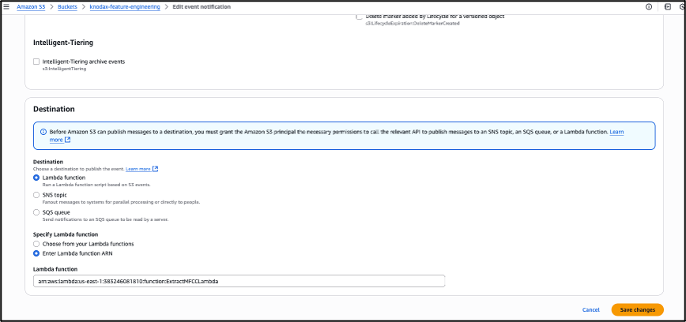
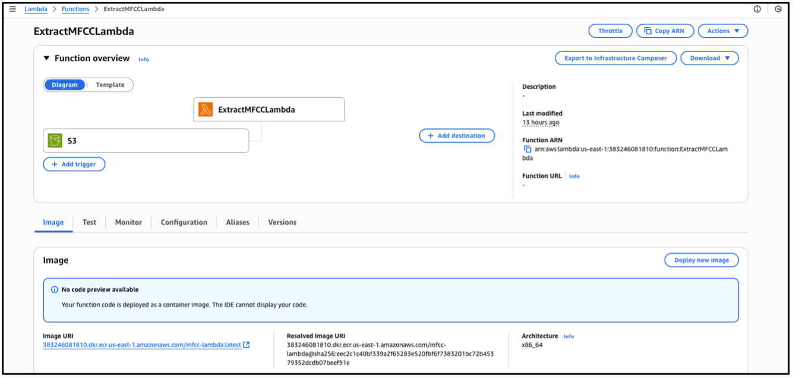
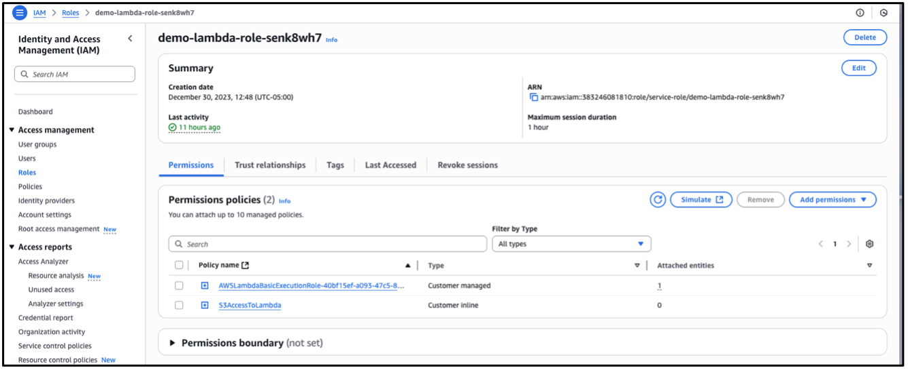
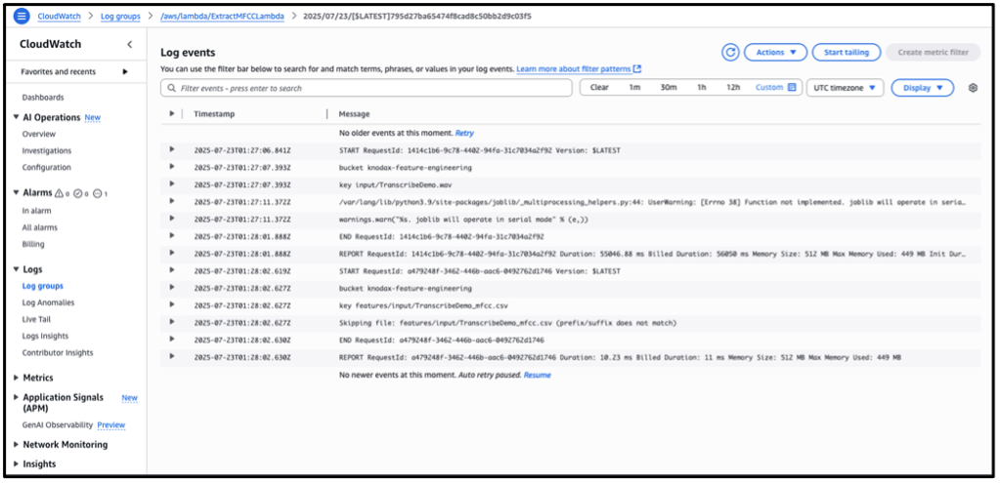
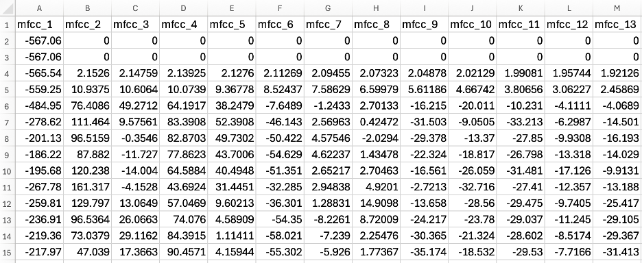

# **Hands-on Lab: Build a Workflow to Extract MFCC Features From Speech Data Using Amazon Transcribe and AWS Lambda**

---

## ⚠️ **AWS Cost Warning**

This lab uses **Amazon Transcribe**, **AWS Lambda**, **Amazon S3**, and **Amazon ECR**, all of which may incur charges depending on usage.

To minimize costs:

* Delete the **ECR repository** after completing the lab.
* Remove the **Lambda function** and container images.
* Delete the **S3 input/output files** once testing is complete.
* Stop any active **Transcribe Jobs** (billed per audio minute).
* Use **small audio files** (few seconds, .wav format).

Always clean up S3 buckets, Docker images, Lambda functions, and event triggers after the exercise.

---

🎥 **YouTube Tutorial:**  
https://youtu.be/YsBrzAFkqoo

---

This lab walks you through building an automated workflow to extract Mel-Frequency Cepstral Coefficients (MFCC) from speech data using AWS S3, Amazon Transcribe, Amazon ECR, and AWS Lambda.

---
📁 **Source Code and Data:**  
https://github.com/knodax-labs-demo/aws-data-and-ml-labs/tree/main/17-mfcc-feature-extraction

---


# **Step 1: Prepare Your AWS Environment**

### **1. Create an S3 Bucket**

In the AWS Console → **Amazon S3**, create a bucket:

```
knodax-feature-engineering
```

### **2. Upload Audio File**

Upload a `.wav` file to:

```
s3://knodax-feature-engineering/input/TranscribeDemo.wav
```

---

# **Step 2: Set Up Amazon Transcribe Job**

Use the provided script `speech_transcriber.py` to upload the file and (optionally) start a Transcribe job.

> **Note:**
> Transcribe is **not required** for MFCC extraction here. It is included only for educational purposes.

### **speech_transcriber.py**

```python
import boto3
 
# Upload Audio via Python
s3 = boto3.client('s3')
s3.upload_file('TranscribeDemo.wav', 'knodax-feature-engineering', 'input/TranscribeDemo.wav')
print("The audio wav file uploaded successfully.")

# Start Transcribe Job
transcribe = boto3.client('transcribe')

transcribe.start_transcription_job(
    TranscriptionJobName='TranscribeDemo',
    Media={'MediaFileUri': 's3://knodax-feature-engineering/input/TranscribeDemo.wav'},
    MediaFormat='wav',
    LanguageCode='en-US',
    OutputBucketName='knodax-feature-engineering'
)

print("transcribe job completed successfully")
```

---

# **Step 3: Create a Docker Image for MFCC Extraction**

This Docker image includes Python, `librosa`, `numpy`, `pandas`, and audio dependencies.

---

## **Dockerfile**

```dockerfile
FROM public.ecr.aws/lambda/python:3.9

ENV NUMBA_DISABLE_CACHE=1
ENV TMPDIR=/tmp

# Install system dependencies
RUN yum -y update && \
    yum -y install python3 pip gcc ffmpeg libsndfile && \
    yum clean all

# Install required libraries
RUN pip install librosa boto3 numpy pandas

# Copy Lambda handler
COPY lambda_mfcc.py .

# Lambda entry point
CMD ["lambda_mfcc.lambda_handler"]
```

---

## **docker-build.sh**

```bash
# Authenticate to ECR
aws ecr get-login-password --region <region> \
| docker login --username AWS --password-stdin <YOUR_ACCOUNT_ID>.dkr.ecr.<region>.amazonaws.com

# Create repository (if not exists)
aws ecr create-repository --repository-name mfcc-lambda

# Build using Lambda-compatible architecture
docker buildx create --use  # optional

docker buildx build --platform linux/amd64 -t mfcc-lambda . --load

# Tag image
docker tag mfcc-lambda:latest <YOUR_ACCOUNT_ID>.dkr.ecr.<region>.amazonaws.com/mfcc-lambda

# Push to ECR
docker push <YOUR_ACCOUNT_ID>.dkr.ecr.<region>.amazonaws.com/mfcc-lambda
```

---

# **Step 4: Deploy AWS Lambda Function**

Use the container image deployed to ECR.

---

## **lambda_mfcc.py**

```python
import boto3
import librosa
import pandas as pd
import os

def lambda_handler(event, context):
    os.environ['NUMBA_DISABLE_CACHE'] = '1'
    os.environ["NUMBA_CACHE_DIR"] = "/tmp"

    s3 = boto3.client('s3')
    bucket = event['Records'][0]['s3']['bucket']['name']
    key = event['Records'][0]['s3']['object']['key']

    prefix_required = "input/TranscribeDemo"
    suffix_required = ".wav"

    if not key.startswith(prefix_required) or not key.endswith(suffix_required):
        print(f"Skipping file: {key}")
        return {"statusCode": 200, "body": f"Ignored file: {key}"}

    audio_path = "/tmp/TranscribeDemo.wav"
    s3.download_file(bucket, key, audio_path)

    # Extract MFCC features
    y, sr = librosa.load(audio_path)
    mfcc = librosa.feature.mfcc(y=y, sr=sr, n_mfcc=13)

    df = pd.DataFrame(mfcc.T)
    df.columns = [f"mfcc_{i+1}" for i in range(df.shape[1])]

    output_str = df.to_csv(index=False)
    output_key = f'features/{key.replace(".wav", "_mfcc.csv")}'

    s3.put_object(Bucket=bucket, Key=output_key, Body=output_str.encode())

    print("ExtractMFCCLambda function executed successfully.")
    return {
        "statusCode": 200,
        "body": f"MFCC features saved to s3://{bucket}/{output_key}"
    }
```

---

## **create_lambda_function_from_docker.sh**

```bash
aws lambda create-function \
  --function-name ExtractMFCCLambda \
  --package-type Image \
  --code ImageUri=<ACCOUNT>.dkr.ecr.<region>.amazonaws.com/mfcc-lambda:latest \
  --role arn:aws:iam::<ACCOUNT>:role/service-role/demo-lambda-role \
  --timeout 300 \
  --memory-size 512
```

---

# **Step 5: Configure S3 → Lambda Trigger**

In your S3 bucket:

### **Create Event Notification:**

* Event type: **PUT**
* Prefix: `input/`
* Suffix: `.wav`
* Destination: **ExtractMFCCLambda**



This ensures MFCC extraction runs automatically when new audio is uploaded.

---

# **Step 6: Test Lambda Manually (Optional)**

Review Lambda Function (lambda_mfcc.py): The provided Lambda function: Saves extracted MFCC features as a CSV file back into your S3 bucket under the features/ folder.


 
IAM Role for AWS Lambda:
 


Ensure the IAM role associated with your AWS Lambda function has Get and Put permissions on the S3 bucket, 
and configure the bucket's event notification with permission to invoke the Lambda function.


---

# **Step 7: Verify MFCC Output in S3**
CloudWatch log screenshot


You will see:

```
s3://knodax-feature-engineering/features/input/TranscribeDemo_mfcc.csv
```
Partial screenshot of the TranscribeDemo_mfcc.csv from the audio file used in this example.



This file contains:

* **mfcc_1 … mfcc_13 columns**
* One row per time frame
* Zero values at the beginning (silence frames)
* 13-dimensional MFCC features

Example shape:

```
(2717, 13)
```

MFCCs are widely used for:

* Speech recognition
* Emotion detection
* Speaker identification
* Audio segmentation

---

# **Congratulations!**

You have built an automated ML feature extraction workflow using:

* **Amazon S3**
* **Amazon Transcribe**
* **AWS Lambda (container-based)**
* **Amazon ECR**
* **librosa-based MFCC extraction**

This architecture is production-ready and demonstrates how serverless audio feature pipelines operate in real ML systems.
