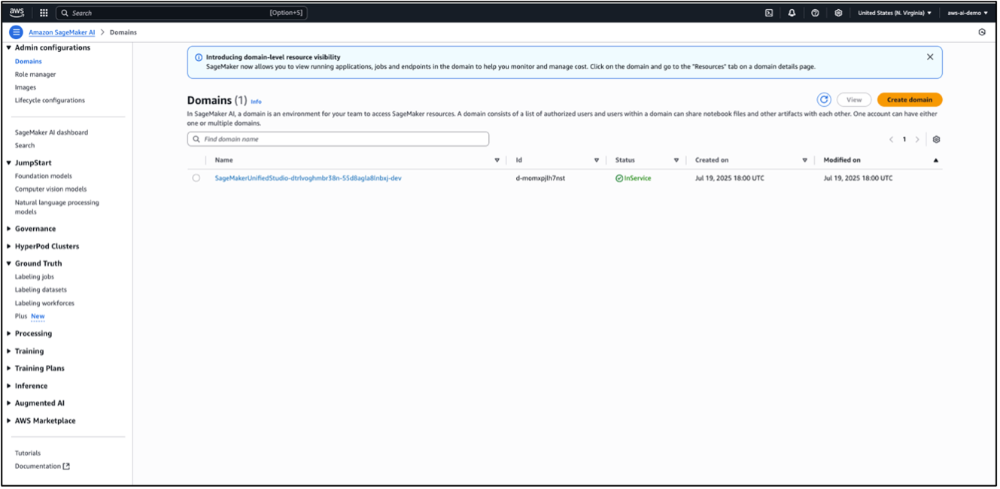
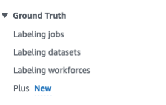
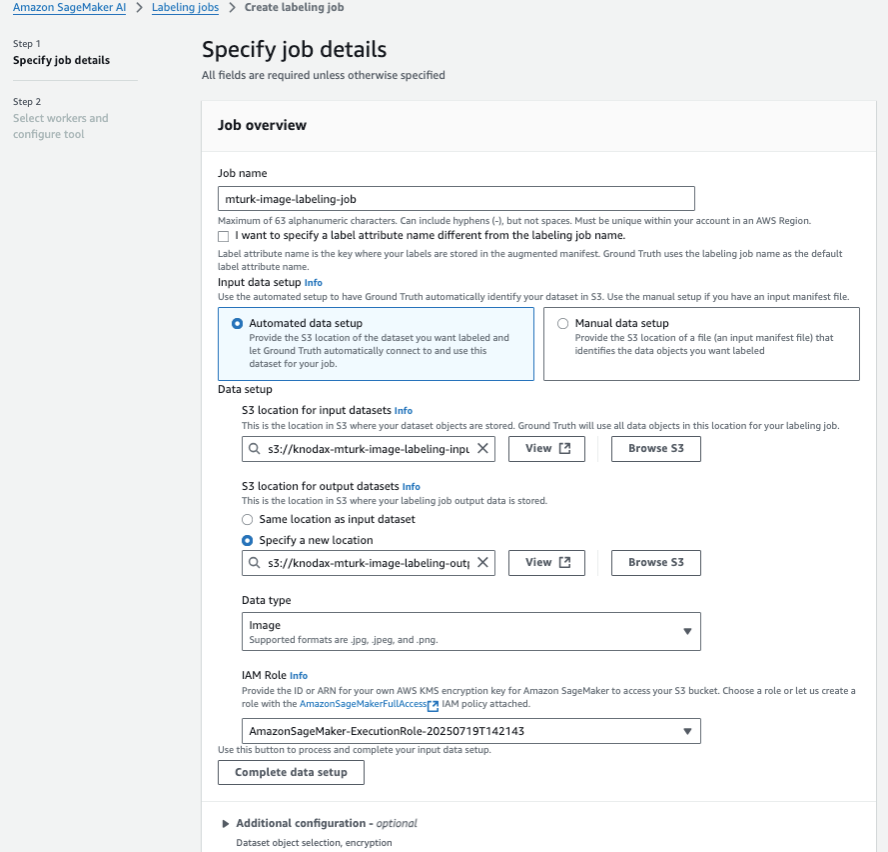
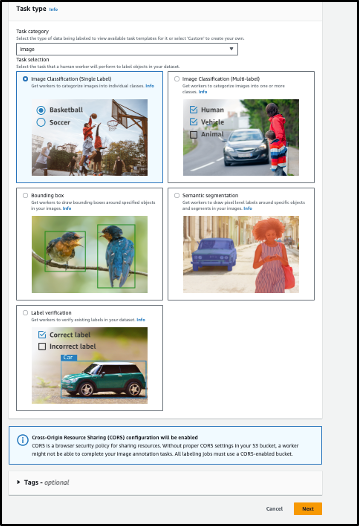
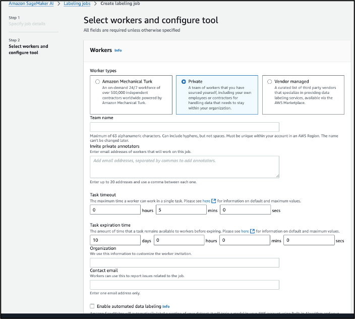

# **Hands-on Lab: Exploring Image Labeling Jobs with Amazon Mechanical Turk via SageMaker Ground Truth**

## **Objective**

In this hands-on lab, you will:

* Create a **SageMaker Domain**
* Explore **Amazon SageMaker Ground Truth**
* Prepare a sample dataset in **Amazon S3**
* Walk through the workflow of creating an **image labeling job**
* Explore how **Amazon Mechanical Turk** can be used as a labeling workforce

This lab helps you understand the labeling workflow **without launching or paying for Mechanical Turk tasks**.

---

🎥 **YouTube Tutorial:**  
https://youtu.be/SCUJQ7n71MU

---

> ⚠️ **AWS Cost Warning**
>
> This lab uses **Amazon SageMaker Domain**, **Amazon S3**, and **IAM roles**, all of which may incur charges—especially the SageMaker Domain if left running.
>
> To minimize costs:
>
> * **Delete the SageMaker Domain** immediately after completing the lab
> * Remove any unused S3 objects created for the labeling exercise
> * Delete auto-created IAM roles if no longer needed
> * Set an **AWS Budget Alert** ($1–$5 recommended)
>
> Amazon Mechanical Turk tasks are **not launched** in this lab, so no MTurk fees will be incurred.

---

# **Step 1: Create a SageMaker Domain**

1. Open the **Amazon SageMaker** console
2. Select **Create Domain**
3. Choose **Quick setup (single-user)**
4. Accept default configurations
5. Wait for provisioning to complete (5–10 minutes)



Once the domain is active, move to the next step.

---

# **Step 2: Explore Ground Truth in SageMaker**

From the SageMaker console:

1. Click **Ground Truth** in the left navigation panel
   
   
   
3. Explore:

   * **Labeling jobs**
   * **Labeling datasets**
   * **Labeling workforces**


### Key Concepts:

* **Labeling jobs** – define data type, task, instructions, and worker configuration
* **Labeling datasets** – track input/unlabeled and labeled outputs
* **Labeling workforces** – choose who performs labeling:

  * **Mechanical Turk (public workforce)**
  * **Private workforce**
  * **Vendor-managed labeling teams**

This exploration helps you understand how Ground Truth organizes labeling workflows.

---

# **Step 3: Prepare the Input Dataset**

1. Open **Amazon S3**
2. Create or select an S3 bucket
3. Upload **two or more sample images** (e.g., cat.jpg, dog.jpg)
4. Copy the folder’s S3 URI



Example:

```
s3://my-labeling-bucket/sample-images/
```


These images will act as your input dataset.

---

# **Step 4: Start Creating a Labeling Job**

Navigate back to **Ground Truth**:

1. Click **Create labeling job**
2. Enter:

   ```
   ImageLabelingTestJob
   ```
3. Input location: paste your S3 image folder URI
4. Output location:

   ```
   s3://my-labeling-bucket/labeled-output/
   ```
5. IAM Role: choose **Create a new role**

   * Allow SageMaker to access your S3 input and output buckets

This sets up the basic structure of a labeling job.

---

# **Step 5: Complete Data Setup**

1. Click **Complete data setup**
2. Confirm Data type:

   * **Image**
3. Continue to the task selection step

This validates the job configuration before choosing the labeling task type.

---

# **Step 6: Explore Task Types and Worker Options**

### Task Type Exploration

Review available **image labeling templates**, such as:



* Image classification
* Bounding box / Object detection
* Semantic segmentation
* Keypoint detection

Click **Next** to proceed without selecting.

---

### Worker Types Exploration

You will see:



* **Amazon Mechanical Turk (public workforce)**
* **Private workforce** (internal team)
* **Vendor-managed workforce** (third-party labeling services)


You are *not required* to start the labeling job—this step is to understand configuration options and capabilities.

---

# **Step 7: Clean Up Resources**

To avoid unnecessary charges:

1. Navigate to **Amazon SageMaker → Domains**
2. Select the domain you created
3. Click **Delete**
4. Confirm removal of associated resources
5. Optional cleanup:

   * Delete S3 image folders
   * Remove IAM roles created for labeling

This ensures you do not incur hourly charges for an active SageMaker Domain.

---

# **Outcome**

By completing this lab, you gained familiarity with:

* Creating a SageMaker Domain
* Navigating Ground Truth labeling components
* Preparing S3 datasets for labeling
* Understanding image labeling job setup
* Exploring MTurk and workforce types
* Reviewing task templates and configuration options

Just let me know!
