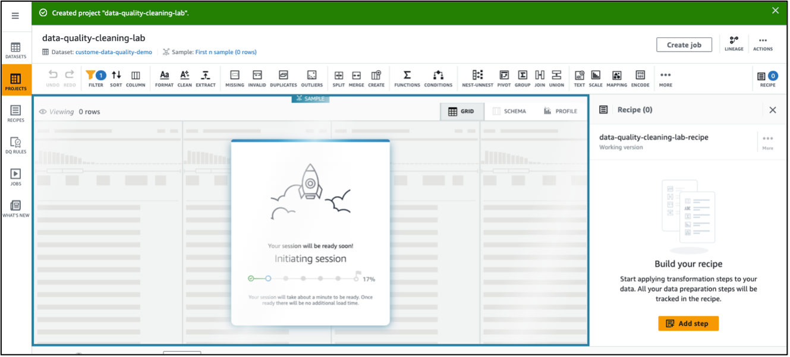
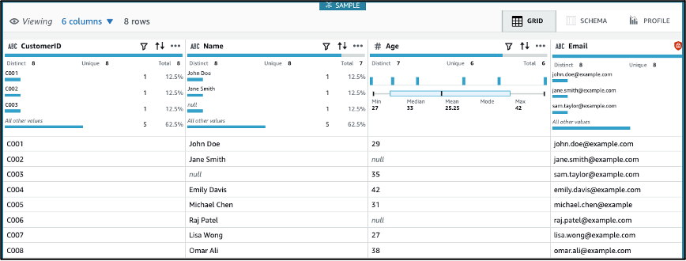
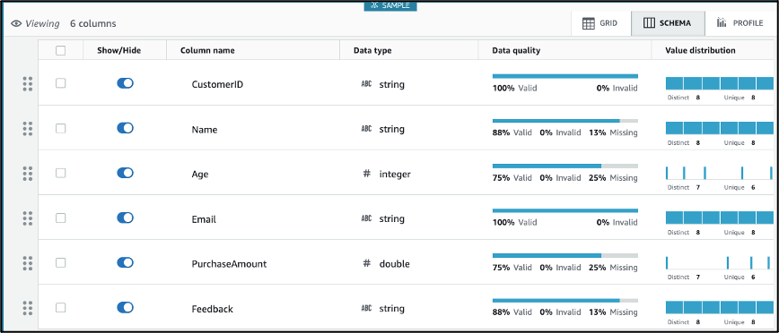
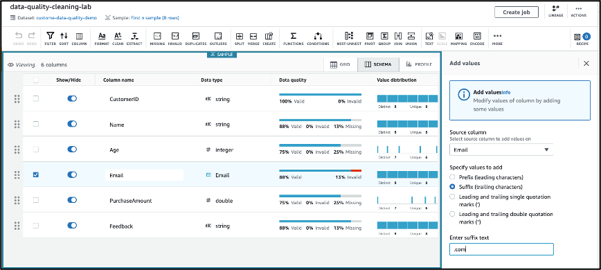
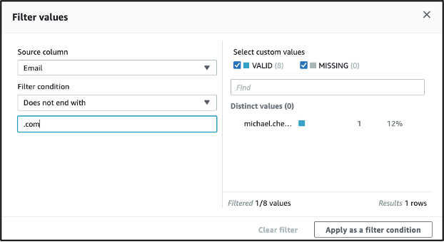
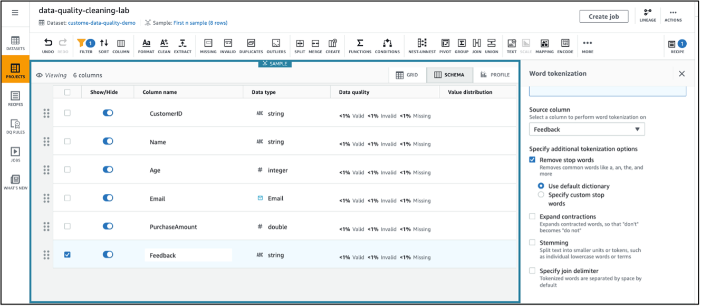

# **Hands-on Lab: Handling Data Quality Issues**

## **Objective**

This lab teaches you how to identify and resolve data quality issues using **AWS Glue DataBrew**.
You will:

* Detect and fix **missing values**
* Clean **corrupted records**
* Apply text transformations such as **stop-word removal**
* Generate a **data profile** for deeper insights

By the end of this lab, you will have a clean dataset prepared for ML workflows and a reusable DataBrew recipe.

---
🎥 **YouTube Tutorial:**  
https://youtu.be/m80hTbAhWL8

---

> ⚠️ **AWS Cost Warning**
>
> This lab uses **AWS Glue DataBrew projects**, **profile jobs**, **recipe jobs**, and **Amazon S3**, which may incur charges.
>
> To minimize costs:
>
> * Delete DataBrew **projects**, **datasets**, and **jobs** after completion
> * Remove S3 output directories created by profiling or recipe jobs
> * Avoid repeatedly running profile jobs (they cost the most)
> * Set an AWS **Budget Alert** ($1–$5 recommended)
>
> Always clean up DataBrew jobs and S3 outputs when you're done.

---

# **Step 1: Prepare Environment**

1. Log into the **AWS Management Console**
2. Open **AWS Glue DataBrew**
3. Ensure your dataset is available in S3

   * Must contain:

     * Missing values
     * Corrupted or inconsistent records
     * Text columns for tokenization

Example dataset:

```
s3://your-bucket/sample-data.csv
```

---

# **Step 2: Create a Dataset in DataBrew**

1. Go to **Datasets** → **Create new dataset**
2. Name it:

   ```
   customer-data-quality-demo
   ```
3. Choose **Amazon S3** as data source
4. Enter file location:

   ```
   s3://your-bucket/sample-data.csv
   ```
5. Click **Create dataset**

### Example dataset (sample-data.csv)

```csv
CustomerID,Name,Age,Email,PurchaseAmount,Feedback
101,John Doe,29,john@example.com,149.50,"Excellent product"
102,Sara Smith,,sara@example.com,89.99,"Good"
103,Billy Brooks,42,billy@sample,66.80,"Very happy"
104,Michael Chen,31,michael.chen@example,129.75,"Loved it"
105,Linda Martinez,,linda@example.com,119.30,"Prompt delivery and good service"
106,Lisa Ali,38,lisa@example.com,78.25,"Average"
```

---

# **Step 3: Create a DataBrew Project for Profiling and Cleaning**

1. Go to **Projects** → **Create project**
2. Name it:

   ```
   data-quality-cleaning-lab
   ```
3. Select the dataset created in Step 2
4. Choose or create an IAM role

   * Auto-created roles include S3 access permissions
5. Click **Create project**

DataBrew will now launch the interactive workspace.



---

# **Step 4: Detect Missing Values**


### 4.1 Explore Column Statistics

* Click **Schema** to view column-level info

* Identify fields with:

  * Missing values
  * Incorrect formats
  * Nulls and blanks

### 4.2 Handle Missing Values

1. Click the column with missing values (e.g., **Age**)
2. Select **Handle missing values → Fill with numeric aggregate**

   * Options: mean, median, mode

### Optional: Run a Data Profile Job

1. Click **PROFILE**
2. Click **Run data profile**
3. Provide job name:

   ```
   customer-data-quality-demo-profile-job
   ```
4. Choose an S3 output path
5. Run profile

This will generate JSON reports showing data statistics, schema, quality scores, correlations, and more.

---

# **Step 5: Clean Corrupt Records**

Identify common issues:

### ✔ Incorrect formats

Examples:

* `michael.chen@example` (missing `.com`)
* Emails not following pattern



### ✔ Apply Fixes

For the `Email` column:

1. Click **⋮ (three dots)** → **Clean**
2. Choose **Add suffix**
3. Add:

   ```
   .com
   ```
4. Click **Apply**

### ✔ Replace corrupted tokens

Use transformations such as:

* **Replace values** (e.g., replace `"N/A"` with null)
* **Filter rows** (remove out-of-range values)
* **Trim whitespace**
* **Convert to lowercase**

---

# **Step 6: Remove Stop Words From Text Fields**

For the **Feedback** column:

1. Click the **⋮ (three dots)** beside the column
2. Choose **Word tokenization**
3. Check **Remove stop words**
4. Leave dictionary as **default**
5. Apply to **All rows**
6. Click **Apply**



This prepares text for NLP and ML tasks.

---

# **Step 7: Save and Publish the Recipe**

A recipe captures every transformation step.

1. Click **Publish Recipe**
2. Name it:

   ```
   data_cleaning_v1
   ```
3. (Optional) Create a **DataBrew job** to apply the recipe
4. Output to a new S3 path for cleaned data

Example output:

```
s3://your-bucket/cleaned-data/
```

---

# **Expected Outcome**

### ✔ Cleaned and processed dataset stored in S3

### ✔ A DataBrew recipe that performs:

* Missing value imputation
* Corrupt record cleaning
* Email and string corrections
* Stop-word removal

### ✔ ML-ready data for downstream analytics and modeling
