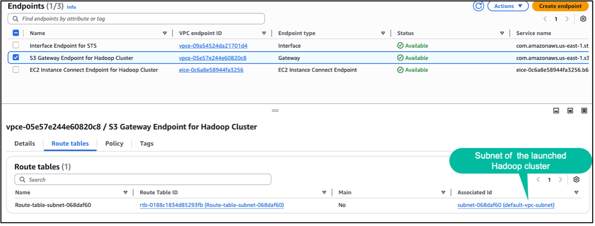
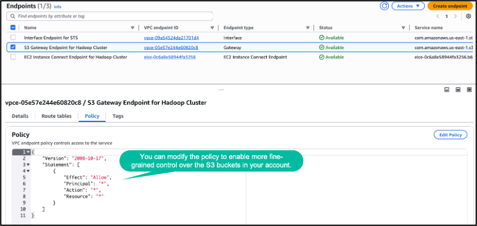
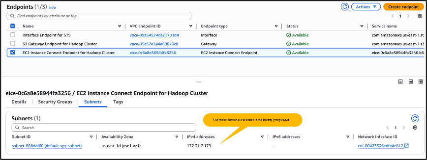

# **Hands-on Lab: Leveraging Big Data Frameworks for ML-Specific Transformations**

## **Objective**

This lab provides hands-on experience using **Amazon EMR** to run ML-focused data processing tasks with:

* **Hadoop MapReduce** for large-scale text processing
* **Apache Spark** for feature engineering and normalization
* **Apache Hive** for aggregation and analytical queries
* **CloudWatch** for monitoring and scaling EMR workloads

These components simulate real-world ML data pipelines that require distributed processing and large data throughput.

---

🎥 **YouTube Tutorial:**  
https://youtu.be/iB9qoFPTf88

---

> ⚠️ **AWS Cost Warning**
>
> **Amazon EMR**, **EMR clusters**, **EC2 instances**, **S3 storage**, **CloudWatch logs**, and **Auto Scaling** can incur significant charges if left running.
>
> To minimize costs:
>
> * Choose **m5.xlarge** only for short-duration workloads
> * **Terminate the EMR cluster immediately** after finishing the lab
> * Delete S3 input/output data when done
> * Disable CloudWatch metrics or detailed monitoring
> * Set an AWS **Budget Alert** ($5 recommended)
>
> Always verify that your EMR cluster and EC2 instances are terminated after the exercise.

---

# **Step 1: Launch an EMR Cluster With Hadoop and Run a MapReduce Job**

---

## **1.1 Create an EMR Cluster**

1. Go to **Amazon EMR Console → Create cluster (Advanced Options)**
2. Under **Software Configuration**, select:

   * **Hadoop** (includes MapReduce)
   * **Spark**
   * **Hive**
3. Choose defaults for instance types:

   * **Master node:** `m5.xlarge`
   * **Core node:** `m5.xlarge`
4. Click **Create cluster**

### 🔹 EMR Node Roles

| Node Type            | Role                                |
| -------------------- | ----------------------------------- |
| **Primary (Master)** | Coordinates cluster & job execution |
| **Core**             | Runs HDFS + tasks                   |
| **Task Nodes**       | Optional workers for scaling        |

---

## **VPC Requirements for EMR (Important)**

### ✔ Create a VPC Gateway Endpoint for S3

Attach it to the **route table** used by EMR subnets.
This allows Hadoop/HDFS jobs to access S3 without public internet.




---

## **S3 Bucket Policy Example**

Use this policy to restrict access to only `emr-demo-input` and `emr-demo-output`:

```json
{
  "Version": "2012-10-17",
  "Statement": [
    {
      "Effect": "Allow",
      "Principal": {
        "AWS": "EMR_ROLE_ARN"
      },
      "Action": [
        "s3:GetObject",
        "s3:PutObject",
        "s3:ListBucket"
      ],
      "Resource": [
        "arn:aws:s3:::emr-demo-input",
        "arn:aws:s3:::emr-demo-input/*",
        "arn:aws:s3:::emr-demo-output",
        "arn:aws:s3:::emr-demo-output/*"
      ]
    }
  ]
}
```

Replace:

```
EMR_ROLE_ARN = arn:aws:iam::<ACCOUNT-ID>:role/MyEMRClusterRole
```

---

## **Bastionless Access: EC2 Instance Connect Endpoint**

Since EMR nodes run in **private subnets**, you must:

* Create an **EC2 Instance Connect Endpoint**
* Update EMR master node **security group**:



Allow inbound SSH (port 22) **from the EC2 Connect Endpoint security group**


---

## **1.2 Prepare Sample Large Text Data**

Upload text files to S3:

```
s3://my-bucket/input-text/
```

Examples:

* Wikipedia articles
* Project Gutenberg books
* News archives

---

## **1.3 Submit a Hadoop MapReduce Job**

SSH into EMR master node:

```bash
ssh hadoop@<master-node-private-dns>
```

Run MapReduce word count:

```bash
hadoop jar /usr/lib/hadoop-mapreduce/hadoop-mapreduce-examples.jar wordcount \
s3://my-bucket/input-text/ s3://my-bucket/output-wordcount/
```

---

# **Step 2: Use Apache Spark on EMR for Data Normalization & Feature Extraction**

---

## **2.1 Launch Spark Shell**

SSH into the master node:

```bash
spark-shell
```

---

## **2.2 Load Sample Dataset**

Example CSV:

```csv
id,height,weight,gender
1,160,65,M
2,170,72,F
3,175,68,
```

---

## **2.3 Spark Code for Feature Engineering**

```scala
import org.apache.spark.sql.functions.col
import org.apache.spark.ml.feature.{StringIndexer, VectorAssembler, MinMaxScaler}

// Step 1: Read CSV
val df = spark.read.option("header", "true").csv("s3://knodax-emr-input/normalization-and-feature-extraction.csv")

// Step 2: Encode gender first
val genderIndexer = new StringIndexer()
  .setInputCol("gender")
  .setOutputCol("genderIndex")

val genderIndexed = genderIndexer.fit(df).transform(df)

// Step 3: Cast numeric fields to double
val dfTyped = genderIndexed.withColumn("height", col("height").cast("double"))
                           .withColumn("weight", col("weight").cast("double"))

// Step 4: Assemble features
val assembler = new VectorAssembler()
  .setInputCols(Array("height", "weight", "genderIndex"))
  .setOutputCol("features")

val featureDF = assembler.transform(dfTyped)

// Step 5: Scale features
val scaler = new MinMaxScaler()
  .setInputCol("features")
  .setOutputCol("scaledFeatures")

val scaledDF = scaler.fit(featureDF).transform(featureDF)

// Step 6: Show output
scaledDF.select("id", "scaledFeatures").show()
```

### ✔ What This Spark Pipeline Does

* Loads CSV from S3
* Encodes categorical gender column
* Casts height/weight to numeric type
* Combines features into vector
* Applies Min-Max normalization
* Returns scaled features for ML model training

---

# **Step 3: Use Apache Hive on EMR to Create Tables and Aggregate Data**

---

Quit Spark:

```
:quit
```

---

## **3.1 Launch Hive**

SSH into master node:

```
hive
```

---

## **3.2 Create an External Hive Table**

```sql
CREATE EXTERNAL TABLE sample_data (
  id INT,
  category STRING,
  value FLOAT
)
ROW FORMAT DELIMITED
FIELDS TERMINATED BY ','
STORED AS TEXTFILE
LOCATION 's3://my-bucket/hive-data/'
TBLPROPERTIES ("skip.header.line.count"="1");
```

### Sample Data

```csv
1,Electronics,199.99
2,Clothing,49.95
3,Books,15.50
4,Electronics,349.00
5,Furniture,120.75
6,Clothing,89.10
7,Toys,25.00
8,Books,9.99
9,Furniture,249.99
10,Toys,30.50
```

---

## **3.3 Run Aggregation Queries**

```sql
SELECT category,
       AVG(value) AS avg_val,
       COUNT(*) AS record_count
FROM sample_data
GROUP BY category;
```

Use these outputs as ML features or summary statistics.

---

# **Step 4: Monitor and Scale Spark Jobs Using EMR Metrics & CloudWatch**

---

## **3.1 Launch EMR Cluster (If Needed)**

Ensure **Spark** is installed and CloudWatch logging is enabled.

---

## **3.2 Monitor CloudWatch Metrics**

Use CloudWatch to monitor:

* YARN memory usage
* HDFS utilization
* EMR cluster health
* Spark job executor CPU/memory

---

## **3.3 Create CloudWatch Alarms**

Examples:

* High memory usage:
  `MemoryTotalMB > 80%`
* HDFS utilization threshold
* High number of active Spark apps

---

## **3.4 Enable Auto Scaling (Optional)**

Attach Auto Scaling policies to EMR nodes based on:

* YARNMemoryAvailablePercentage
* ContainerPendingRatio
* HDFSUtilization

---

# **Summary Table**

| Task                   | Tool/Service             | Purpose                             |
| ---------------------- | ------------------------ | ----------------------------------- |
| Hadoop MapReduce       | EMR + Hadoop             | Large-scale text processing         |
| Spark ML Preprocessing | EMR + Spark              | Feature engineering & normalization |
| Hive Aggregation       | EMR + Hive               | Structured data summarization       |
| Monitoring & Scaling   | CloudWatch + EMR Metrics | Job monitoring & auto scaling       |

