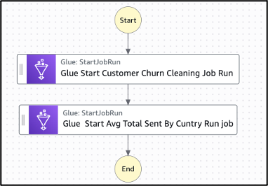
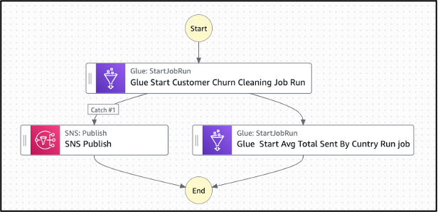

# ** Hands-on Lab: Managing ML-Focused Data Transformation Pipelines**

## **Objective**

This lab teaches you how to build and orchestrate a multi-step **ML preprocessing pipeline** using:

* **AWS Glue Studio** for data cleaning and aggregation
* **AWS Step Functions** for coordinating multiple Glue ETL steps
* **EMR Metrics & Amazon CloudWatch** for monitoring and scaling Spark-based processing

By the end of this lab, you will have a fully automated transformation pipeline capable of handling ML-focused preprocessing.

---
🎥 **YouTube Tutorial:**  
https://youtu.be/n8iWg9XzHlg

---

> ⚠️ **AWS Cost Warning**
>
> This lab uses **AWS Glue Jobs**, **Glue Crawlers**, **Step Functions**, **S3 storage**, and optional **EMR/Spark monitoring**, all of which can incur AWS charges.
>
> To minimize costs:
>
> * Delete Glue **jobs**, **workflows**, **crawlers**, and **temp tables** afterward
> * Delete Step Functions **state machines** and **executions**
> * Remove S3 output files if not needed
> * Disable CloudWatch logs/alarms or delete them
> * Set an AWS **Budget Alert** ($5 recommended)
>
> Always clean up Glue and Step Functions resources after completing the lab.

---

# **Step 1: Build a Transformation Workflow in AWS Glue Studio**

---

## **1.1 Open AWS Glue Studio**

1. Go to **AWS Glue Studio**
2. Click **Create Job → Visual with source and target**

This creates the base of your transformation pipeline.

---

## **1.2 Add the Data Source**

Select a dataset stored in Amazon S3.

Example source data:

```
s3://my-bucket/customer_churn_data.csv
```

### **Sample: customer_churn_data.csv**

```csv
CustomerID,Name,Age,Gender,Country,SignupDate,LastPurchaseDate,TotalPurchases,TotalSpent,Churned
101,John Smith,34,Male,USA,2021-06-01,2023-07-15,15,1230.50,No
102,Maria Garcia,29,Female,Canada,2022-01-20,2023-06-10,8,745.00,No
103,Liu Wei,45,Male,China,2020-11-05,2021-12-12,3,210.90,Yes
104,Sara Khan,31,Female,UK,2021-02-15,2023-03-18,10,880.75,No
105,Pedro Silva,,Male,Brazil,2021-09-25,2023-02-05,6,502.00,Yes
105,Pedro Silva,,Male,Brazil,2021-09-25,2023-02-05,6,502.00,Yes
106,Aisha Ali,38,Female,UAE,2022-05-30,,5,430.00,No
107,Takeshi Tanaka,41,Male,Japan,2020-08-10,2022-10-21,12,999.99,Yes
108,Anna Müller,27,Female,Germany,2022-03-12,2023-07-01,9,815.20,No
109,Kofi Mensah,35,Male,Ghana,2021-07-18,2023-01-30,4,330.00,Yes
110,Lara Rossi,30,Female,Italy,2021-12-22,2023-06-28,7,640.80,No
```

---

## **1.3 Create and Run AWS Glue ETL Jobs**

You will create **two Glue ETL jobs**:

---

### **Job 1 — customer-churn-cleaning-job**

Purpose: **Remove duplicate records** and fix missing values.

**Output bucket:**

```
s3://clean-job-output/
```

Transformations may include:

* Dropping duplicates by `CustomerID`
* Filling missing values (e.g., replace missing `Age`)
* Ensuring date formats
* Filtering corrupted rows

---

### **Job 2 — customer-churn-avg-total-spent-by-country-job**

Purpose: **Aggregate customer spending per country**.

**Input:** Output from Job 1
**Output bucket:**

```
s3://etl-job-output/
```

Operations may include:

* Group by **Country**
* Aggregate:

  * `AVG(TotalSpent)`
  * `COUNT(CustomerID)`
* Write ML-ready features for churn modeling

---

### After defining both jobs:

* Configure required **IAM roles** with S3 read/write access
* Choose a worker type (G.1X for small datasets)
* Save and run each job individually to confirm correctness

---

# **Step 2: Use AWS Step Functions to Coordinate the Multi-Step Pipeline**

---

## **2.1 Create a Step Function State Machine**

1. Go to **AWS Step Functions Console**
2. Choose **Create State Machine → Author with code / Blank**
3. Name it:

```
Customer-Churn-State-Machine
```

---

## **2.2 Define Transformation States**

Create two sequential steps:

1. **Run Clean Job**

   * Executes `customer-churn-cleaning-job`

2. **Run Aggregation Job**

   * Executes `customer-churn-avg-total-spent-by-country-job`



You may also add:
* Retry logic
* Catch blocks
* Failure transitions
* SNS notifications



### Example (High-level pseudo-ASL)

```json
{
  "StartAt": "RunCleaningJob",
  "States": {
    "RunCleaningJob": {
      "Type": "Task",
      "Resource": "arn:aws:states:::glue:startJobRun.sync",
      "Parameters": {
        "JobName": "customer-churn-cleaning-job"
      },
      "Next": "RunAggregationJob"
    },
    "RunAggregationJob": {
      "Type": "Task",
      "Resource": "arn:aws:states:::glue:startJobRun.sync",
      "Parameters": {
        "JobName": "customer-churn-avg-total-spent-by-country-job"
      },
      "End": true
    }
  }
}
```

---

## **2.3 Execute and Monitor Workflow**

* Run your state machine
* Verify job transitions in the Step Functions visual graph
* Enable SNS or EventBridge notifications for failures

---

# **Summary Table**

| Component                       | Tool                    | Description                                  |
| ------------------------------- | ----------------------- | -------------------------------------------- |
| **Data Cleaning & Aggregation** | AWS Glue Studio         | Removes duplicates, aggregates spending data |
| **Orchestration**               | AWS Step Functions      | Coordinates multi-step workflow execution    |
| **Monitoring (Optional)**       | EMR Metrics, CloudWatch | Observe job performance, configure alerts    |


